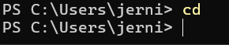
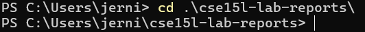
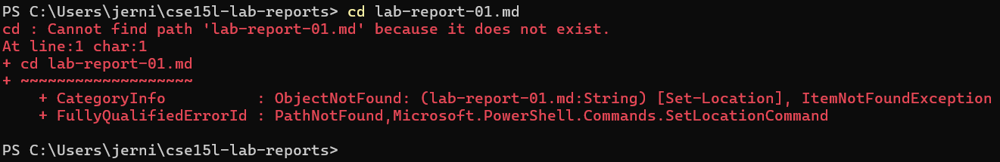
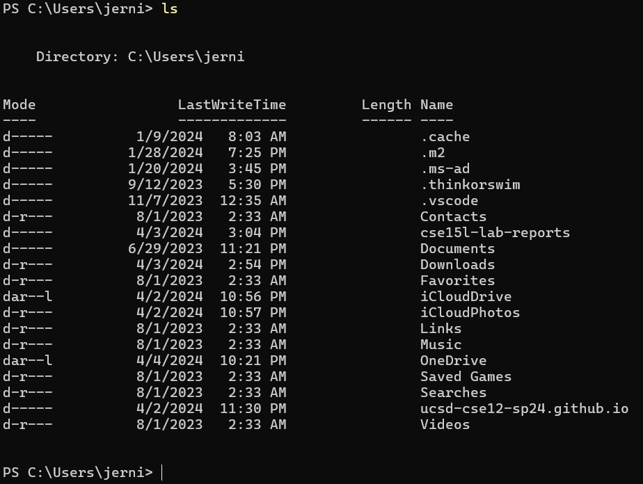
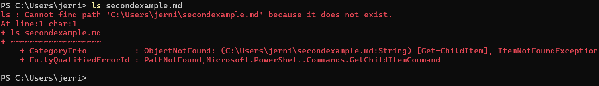
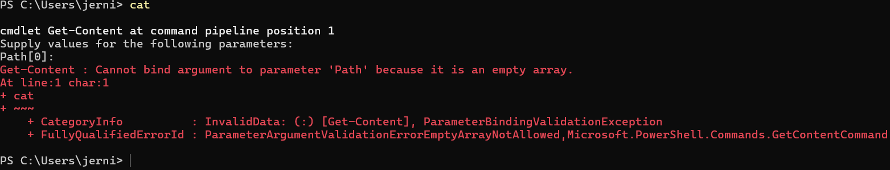
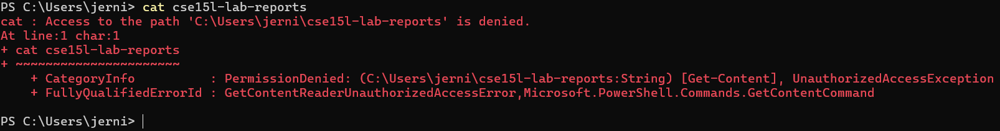

# Lab Report 1: Remote Access and FileSystem (week 2)
---
## FileSystem Commands examples:
1. ```cd```
   - Result of ```cd ```: 
      - cd with no arg;
      - Absolute path to working directory: ```/Users/jerni```;
      - Executing the ```cd``` command without an argument did nothing as it doesn't know what  folder/directory/file path to enter into;
   - Result of ```cd cse15l-lab-reports```: 
      - cd with with path to directory/folder as arg
      - Absolute path to working directory: ```/Users/jerni```;
      - Executing the ```cd``` command with an existing subfolder path as its argument effectivley enters into that directory or folder from the working directory without error
   - Result of ```cd lab-report-01.md```: 
      - cd with path to file as arg
      - Absolute path to working directory: ```/Users/jerni/cse15l-lab-reports```;
      - Executing the ```cd``` command with an existing subfile path as its argument from the working directory threw an error (ItemNotFoundException) as I attempted to "change directory" into a file of the working directory
---
3. ```ls```
   - Result of ```ls ```: 
      - ls with no arg'
   - Result of ```ls cse15l-lab-reports```: 
      - ls with with path to directory/folder as arg;
   - Result of ```ls secondexample.md```: 
      - ls with path to file as arg;
---
5. ```cat```
   - Result of ```cat ```: 
      - cat with no arg;
   - Result of ```cat cse15l-lab-reports```: 
      - cat with with path to directory/folder as arg;
   - Result of ```cat lab-report-01.md```: 
      - cat with path to file as arg;
