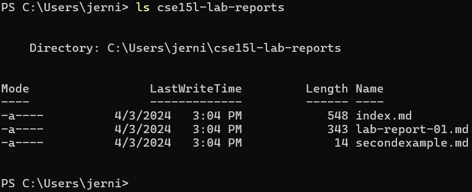

# Lab Report 1: Remote Access and FileSystem (week 2)
---
## FileSystem Commands examples:
1. ```cd```
   - Result of ```cd ```: 
      - cd with no arg;
      - Absolute path to working directory: ```/Users/jerni```;
      - Executing the ```cd``` command without an argument did nothing as it doesn't know what  folder/directory/file path to enter into;
   - Result of ```cd cse15l-lab-reports```: 
      - cd with with path to directory/folder as arg
      - Absolute path to working directory: ```/Users/jerni```;
      - Executing the ```cd``` command with an existing subfolder path as its argument effectivley enters into that directory or folder from the working directory without error
   - Result of ```cd lab-report-01.md```: 
      - cd with path to file as arg
      - Absolute path to working directory: ```/Users/jerni/cse15l-lab-reports```;
      - Executing the ```cd``` command with an existing subfile path as its argument from the working directory threw an error (ItemNotFoundException) as I attempted to "change directory" into a file of the working directory

---
2. ```ls```
   - Result of ```ls ```: 
      - ls with no arg;
      - Absolute path to working directory: ```/Users/jerni```;
      - Executing the ```ls``` command without any arguments served to output or print a list of all the folder and files in the current working directory
   - Result of ```ls cse15l-lab-reports```: 
      - ls with with path to directory/folder as arg;
      - Absolute path to working directory: ```/User/jerni```
      - Executing the ```ls``` command and passing a folder/directory to its parameters serves to output or print a list of all the folders and files contained withing this passed folder/directory;
   - Result of ```ls secondexample.md```: 
      - ls with path to file as arg;
      - Absolute path to working directory: ```/Users/jerni```
      - Executing the ```ls``` command with the relative path to a file casued another error and blew up in the terminal (ItemNotFoundException), i'm assuming this is because there are no other files/directories to list out contained within the passsed file.

---
3. ```cat```
   - Result of ```cat ```: 
      - cat with no arg;
      - Absolute path to working directory: ```/Users/jerni```;
      - Executing the ```cat``` command without any arguments threw an exception in the terminal and did not work becasue the command is intended to print out the contents of the filename from the path that is passed through its parameters;
   - Result of ```cat cse15l-lab-reports```: 
      - cat with with path to directory/folder as arg;
      - Absolute path to working directory: ```/Users/jerni```;
      - Executing the ```cat``` command with a folder/directory passed as an argument to its parameters also threw an exception because it's meant to print out the contents of a file rather than printing filenames and potential subfolder names withing a directory;
   - Result of ```cat lab-report-01.md```: 
      - cat with path to file as arg;
      - Absolute path to woeking directory: ```/User/jerni/cse15l-lab-reports```;
      - Executing the ```cat``` command, with a proper existing subfile within the working directory passed to its parameters, worked as intended and in this particular case and printed out the contents of the argued Markdown text file in the terminal;
